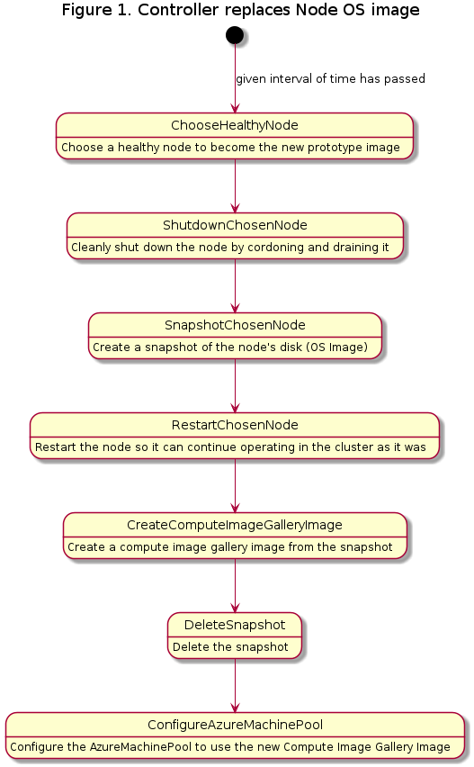

# Title 
Integrate Node OS Image caching with CAPZ

## Table of Contents

- [Title](#title)
  - [Table of Contents](#table-of-contents)
  - [Glossary](#glossary)
  - [Summary](#summary)
  - [Motivation](#motivation)
    - [Goals](#goals)
    - [Non-Goals/Future Work](#non-goalsfuture-work)
  - [Proposal](#proposal)
    - [User Stories](#user-stories)
      - [Story 1](#story-1)
      - [Story 2](#story-2)
    - [Requirements (Optional)](#requirements-optional)
      - [Functional Requirements](#functional-requirements)
        - [FR1](#fr1)
        - [FR2](#fr2)
      - [Non-Functional Requirements](#non-functional-requirements)
        - [NFR1](#nfr1)
        - [NFR2](#nfr2)
    - [Implementation Details/Notes/Constraints](#implementation-detailsnotesconstraints)
    - [Security Model](#security-model)
    - [Risks and Mitigations](#risks-and-mitigations)
  - [Alternatives](#alternatives)
  - [Upgrade Strategy](#upgrade-strategy)
  - [Additional Details](#additional-details)
    - [Test Plan [optional]](#test-plan-optional)
    - [Graduation Criteria [optional]](#graduation-criteria-optional)
    - [Version Skew Strategy [optional]](#version-skew-strategy-optional)
  - [Implementation History](#implementation-history)

## Glossary

Node Prototype Pattern - Where we take a known good/working OS snapshot and make a “prototype” upon which all future node OS’ images are based.

Warm nodes - The concept of keeping up extraneous and unused nodes to prevent having to wait for patches or security updates, thus allowing you to have those nodes ready when more users try to use your service without the wait times.

Shared Image Gallery - A repository that is an Azure Resource for managing and sharing images

Snapshot - A static copy of the image at the point in time that it is taken

Blessed Node - Whichever node has been the most stable and is chosen off of that metric as the one to clone the OS image of and cache it for future nodes to use

## Summary

A controller will be added to CAPZ which caches the Nodes’ OS image on a regular interval and updates the model to use that image for future scale outs. This feature will allow for:
- faster horizontal scaling 
- prevent security alerts from new nodes which immediately need a security update as those new nodes will now come with the security update already installed
- help prevent users from needing to spin up warm nodes and overprovision

## Motivation

A model scenario would be an operator spinning up a CAPZ cluster and having this feature be able to be toggled on or off with an environment variable. If it was toggled on, then as the months passed and more security updates and patches needed to be applied to the operator’s node OS image, these changes would be cached on a regular interval and the operator would no longer have to wait for these changes to apply on new node creations. As a result, users will have faster horizontal scaling and require fewer warm nodes and overprovisioning to avoid this problem, especially since the new nodes will have the container images of the applications it will run pre-cached so pods will run quicker when scheduled. This feature will also help users have better security compliance as new nodes will already be compliant instead of needing to patch.

#### Credits

A big thank you to Jack Francis, Michael Sinz, and Amr Hanafi for their work on the Kamino project that used a similar Prototype Pattern with AKSEngine which inspired this feature request: https://github.com/jackfrancis/kamino

### Goals

1. A solution using the Node Prototype pattern which cache’s nodes’ OS image on a regular interval and replaces it as a new ‘golden image’.
1. Faster horizontal scale outs
1. Prevent security breaking issues on node bootup from security updates being required immediately

We will know we’ve succeeded when we can benchmark speed increases and successful image changes

### Non-Goals/Future Work

1. Extend the functionality to Windows nodes
1. Optimization for efficiency and scalability
1. A more complicated method of selecting a good candidate node such as incorporating manual forced prototype creation, which would perform better but take research to find the optimal method. 
1. Optimization of the default time interval into a specific, best general default which would have to be researched

## Proposal

### User Stories

#### As an operator of CAPZ, I want faster horizontal scaling on new node deployment

People setting up CAPZ clusters will be able to have faster horizontal scaling because their Nodes’s OS images will be continually cached, and thus they will be able to avoid longer pull times and avoid having to create warm nodes and overprovision.

#### As an operator, I want to be able to be more inline with security compliance as I spin up nodes

As an operator I would like to be able to have my node’s OS image cache for the ability to avoid security alerts, cache security updates and patches so that I’ll be more security compliant and up to date when I have to spin up a new node. Otherwise, flags will be raised that a node is out of date on boot up before it finishes patching and a temporary security risk will exist.

#### As an operator, I want to be able to have pods run quicker when scheduled

As a cluster operator I want to bring up new nodes that already have the container images of the applications it will run pre-cached so that pods start running quicker when scheduled.

### Requirements (Optional)

#### Functional Requirements

None currently known to be needed

##### FR1

##### FR2

#### Non-Functional Requirements

##### NFR1

##### NFR2

### Implementation Details/Notes/Constraints

The plan is to modify the existing Controllers with the Node Prototype Pattern as desired. These controller additions can be added to AzureMachine Controller and AzureMachinePool Controller.

An operator will be able to decide to turn the feature on or off with an environment variable on creation of a cluster, and then can update the AzureMachineTemplate and AzureMachinePool to customize how long they want the caching interval to be (see the yaml files below in this section for the caching interval).

Example of the enviornment variable being turned on:

```
export AZURE_OS_CACHING=true
```

The controller will maintain a timestamp, and when the current time is the chosen interval ahead or more, the controller will perform the caching. When the process is started it should go through the nodes of the cluster, choose a healthy node, shut it down, take a snapshot of it, restart it, create a shared image gallery image, delete the snapshot, and then configure the AzureMachineTemplate specs to use that shared image gallery image. After, it will store the current time as its timestamp.

As for why the healthy node has to be shut down while creating a snapshot of it, if it isn’t shut down first then pods can be scheduled as the snapshot is taken which will cause some dangerous states in terms of how it exists after being utilized by the AzureMachineTemplates.

In terms of how a healthy node would be selected, there is already an annotation on each node from its status as to when they’ve last been patched. An ideal node would be one which has been patched since the last prototype went into service and is running and healthy. Whichever node has been steadily healthy for the longest amount of time should be chosen as it’s the most overall stable. As the prototype is always from a successfully healthy and working node the image is always known to be working before being chosen for replication.

In terms of data model changes, AzureMachine and AzureMachinePool changes are likely and the changes we expect will be purely additive and nonbreaking. No removals should be required to the data model. For AzureMachine on AzureMachineTemplate we will add a new optional field under spec.template.spec called nodeCachingMode which will be enabled if present and a sub field under that called cacheInterval which will be set to 1 day by default, and it will be a required subfield of nodeCachingMode if that field is there. For AzureMachinePool we will do the same thing under spec.template in the AzureMachinePool files.

Example AzureMachineTemplate yaml:
```yaml
apiVersion: infrastructure.cluster.x-k8s.io/v1beta1
kind: AzureMachineTemplate
metadata:
  name: node-os-image-caching-machine-template
  namespace: default
spec:
  template:
    spec:
      nodeCachingMode:
        interval: 24h
```

Example AzureMachinePool yaml:
```yaml
apiVersion: infrastructure.cluster.x-k8s.io/v1beta1
kind: AzureMachinePool
metadata:
  name: node-os-image-caching-machine-pool
  namespace: default
spec:
  template:
    nodeCachingMode:
      interval: 24h
```



### Security Model
This proposal requires CAPZ to have write permissions for azureMachineTemplates in order to properly update the nodes’ OS image on the spec. Regex expressions will potentially be used for when a user declares a time amount for the interval that they want to specify, and denial of service attacks will be protected against by having an update system which doesn’t need to be atomic, if part of the caching is complete there is no risk in the update not finishing since the spec update will happen at once. No sensitive data is being stored in a secret. 

### Risks and Mitigations

Example risks:
1. A bad snapshot is taken, and we will mitigate this risk by having a rollback if a bad snapshot is detected as taken and have prevention techniques in place to detect if the snapshot is bad before taking it.
1. A bad security patch or update might have been applied to a user’s node that they don’t want to be applied to future nodes. To mitigate this risk, we will make it easy for users to turn this feature off, and if they fix it on their original node the snapshot will be taken of that node instead.

The UX will mostly be impactful towards operators and members of the CAPZ community will test these changes and give feedback on them. Security will also likely follow in terms of how it gets reviewed, but no major security problems should be possible from this change. For folks who work outside the SIG or subproject, they should hopefully have faster horizontal scaling without needing to directly do anything outside of setting an environment variable on cluster creation or updating their AzureMachinePools and AzureMachineTemplates.


## Alternatives

No currently known alternatives exist which are public and have been implemented for CAPZ. A savvy operator may also have created a similar system for their nodes but we hope to offload that responsibility to the CAPZ team in this process, and currently no other open source implementations of this for CAPZ are known to exist. 

In terms of when to take a snapshot, a day is given as a general example which should be good for typical use but the specification of how often will be customizable as we know that certain operators have different strategies and use cases for how they’re running their services on our clusters.

In terms of how we choose a node as the blessed one, lots of different metrics or heuristics can be used like manually creating a temporary prototype for testing, having the fastest ready time, or anything else which is seen as typically good but a more generalist approach is outlined here since more specific methods may not be as helpful for certain operators. 
For architectural details of where else the code could exist, the controller section makes the most sense since this proposal will be constantly modifying the state of our objects, but theoretically it could be largely put into hack with shell scripts and then a controller could simply be ordered to trigger that shell script, but this is less maintainable in the long run and not as preferred. 

## Upgrade Strategy

Turning off or on the feature for a particular operator is done with them setting an environment variable and that is all that is required to keep previous behavior or make use of the enhancement. No backwards compatibility will be broken, all this feature request will do is change previous controllers and add optional fields to AzureMachinePool and AzureMachineTemplate which can be utilized or not as desired.

## Additional Details

### Test Plan [optional]

There will be e2e tests, at least one of which will be as follows:
Have an example node and an example patch, apply the patch to the preexisting node, and then trigger the controller to pretend the interval of time has passed, and then it should attempt to create another node and compare the OS image of the new node and the original node, finding that they are both the same image.

It should be tested primarily in isolation as other components shouldn’t affect what it tries to do, but it may need to be checked with other components to see what happens if certain race conditions or updates at the same time of AzureMachineTemplate are occurring (in which case a lower priority should likely be assigned to this controller for finishing its task after as ideally those changes are in effect before isolating the node).

### Graduation Criteria [optional]

alpha - The feature is initially constructed and toggleable with an environment variable
beta - The feature has e2e tests implemented and is more integrated and seamless with the project
stable - The feature has been used for a while and is widely acceptable as well as reliable and will now be enabled by default.

### Version Skew Strategy [optional]

The feature itself should not depend significantly on the version of CAPI and will be backwards compatible with old versions of CAPZ since it will be a toggleable feature, so if there is a drift in CAPI and CAPZ versions the functionality should stay the same without breaking anything.

## Implementation History

- [ ] MM/DD/YYYY: Proposed idea in an issue or [community meeting]
- [ ] MM/DD/YYYY: Compile a Google Doc following the CAEP template (link here)
- [ ] MM/DD/YYYY: First round of feedback from community
- [ ] MM/DD/YYYY: Present proposal at a [community meeting]
- [ ] MM/DD/YYYY: Open proposal PR

<!-- Links -->
[community meeting]: https://docs.google.com/document/d/1ushaVqAKYnZ2VN_aa3GyKlS4kEd6bSug13xaXOakAQI/edit#heading=h.pxsq37pzkbdq

